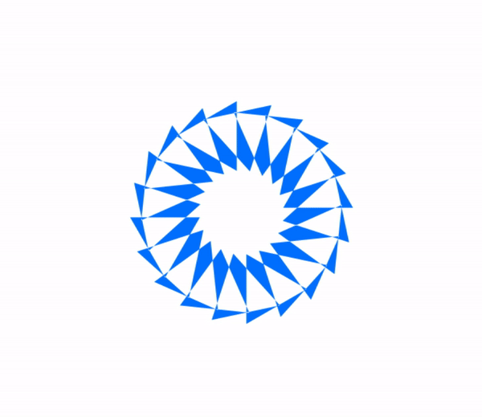

# Day 43

## Paths 
 
`Paths` - это брат `CGPath` из `UIKit`, если у Вас уже был опыт работы с `CGPath`, то усвоиться с новым протеже будет просто.
 
Давайте рассмотрим пример:
 
```swift

  var body: some View {
    Path { path in
      path.move(to: CGPoint(x: screenWidth / 2, y: 0))
      path.addLine(to: CGPoint(x: screenWidth / 2 - 100, y: 200))
      path.addLine(to: CGPoint(x: screenWidth / 2 + 100, y: 200))
    }
  }
  
```

`move` - перетаскивает точку, от которой начнем рисунок, в определенное место
`addLine` - рисует линию до указанной точки

(Посмотрите полный список того, что вы можете сделать с `Path` [Apple doc](https://developer.apple.com/documentation/swiftui/path))

После создания фигуры с помощью `Path` можно к ней применить некоторые модификаторы, которые мы используем для наших view 

## Shapes

В предыдущем варианте наш треугольник не переиспользовать. Для этих целей существует `Shape`, благодаря которому можно легко обернуть `Path` и снова использовать фигуру повторно

Пример:

```swift

struct Triangle: Shape {

  func path(in rect: CGRect) -> Path {
    var path = Path()
    path.move(to: CGPoint(x: rect.midX, y: rect.minY))
    path.addLine(to: CGPoint(x: rect.minX, y: rect.maxY))
    path.addLine(to: CGPoint(x: rect.maxX, y: rect.maxY))
    path.addLine(to: CGPoint(x: rect.midX, y: rect.minY))

	return path
  }
}

```

Также использовать  `Shape` благоразумно, когда фигуры сложные, при этом имеют изменяемые свойства

```swift

struct Arc: Shape {

  var startAngle: Angle
  var endAngle: Angle
  var clockwise: Bool

  func path(in rect: CGRect) -> Path {
    var path = Path()
    path.addArc(center: CGPoint(x: rect.midX, y: rect.midY), 
				radius: rect.width / 2,
				startAngle: startAngle,
				endAngle: endAngle,
				clockwise: clockwise)
    return path
  }
}

```

Теперь можно использовать Arc неоднократно, при этом видоизменять фигуру


## InsettableShape

Давайте разберем в чем отличие  `strokeBorder`  от  `stroke`
Оба модификатора задают жирную границу для вью, но первый модификатор расширяет границу внутрь нашей фигуры, а при использовании второго модификатора граница расширяется на половину внутрь фигуры, наполовину вне фигуры.

Использовать второй тип модификатора нельзя пока ваше view не комфермит протокол `InsettableShape` 

Давайте дополним Arc из предыдущего примера:

```swift

struct Arc: Shape, InsettableShape {

  var startAngle: Angle
  var endAngle: Angle
  var clockwise: Bool
  var insetAmount: CGFloat = 0

  func path(in rect: CGRect) -> Path {
    var path = Path()
    path.addArc(center: CGPoint(x: rect.midX, y: rect.midY),
				radius: rect.width / 2 - insetAmount,
				startAngle: startAngle,
				endAngle: endAngle,
				clockwise: clockwise)
    return path
  }

  func inset(by amount: CGFloat) -> some InsettableShape {
	var arc = self
	arc.insetAmount += amount
		return arc
	}
}

```

Кроме того, что нужно реализовать метод `inset(by amount: CGFloat)` нужно задать переменную, где будет хранится размер отступа (В пример выше это переменная insetAmount).
В нашем случае при установки `strokeBorder` мы должны повлиять на радиус арки поэтому, очевидно, мы должны от текущего радиуса отнять, указанный отступ

(Если ваш объект комфермит протокол `InsettableShape` , то он (объект) автоматически комфермит протокол `Shape`. В примере выше можно удалить первый протокол)

# Day 44

## ImagePaint

Как мы знаем цвет в SwiftUI - View. Также цвет можно использовать в качестве аргумента, где требуется передать`ShapeStyle`. 
С картинками немного другая история. Картинку, так же как и цвет можно передавать туда куда требуется `View`

```(swift)

var body: some View {
  Text("Some text")
    .background(Image("someImage"))
}

```

Но установить просто картинку в качестве границ view не получится. Для этого используйте `ImagePaint`

```(swift)

var body: some View { 
  Text(Some text)
    .border(ImagePaint("someImage"))
}

```

## Day 45

## Blend mode, saturation, blur

- Blend mode или режим наложения, можно установить с помощью модификатора `.blendMode`.
Режим наложения это правило, по которому взаимодействуют цвета объектов наложенный друг на друга.
Например режим `multiply` умножает цвет пискеля верхнего и нижнего слоя. 

(Подробное описание каждого режима можно прочитать [тут](http://takpro100.net.ua/beginer/178-blending.html))

- Saturation или насыщенность описывает насколько сильно выражен цвет (модификатор: `saturation`)

- Blur размытость - насколько размыт объект (модификатор: `blur`)

## animatableData

AnimatableData - вычислительное свойство, которое идет с протоколом `Animatable`. Это свойство нужно для того, чтобы явно указать, какая переменная будет изменяться с анимацией.

Если вы попробуйте сделать анимацию свойства вашей фигуры, как мы делали раньше:

```swift

withAnimation { 
  self.youCustomShapeProperty = newValue
}

```

То ваша фигура не будет меняться с анимацией, поскольку SwiftUI не оценивает текущее и конечное состояние вашей фигуры. Чтобы это произошло, как раз и нужно прописывать свойство `animatableData` в вашей фигуре

Пример: 

```swift

var animatableData: CGFloat {
  get { insetAmount }
  set { self.insetAmount = newValue }
}

```

Больше примеров можете найти в файлах: ***Trapezoid.swift***, ***Flower.swift***, ***Star.swift***


